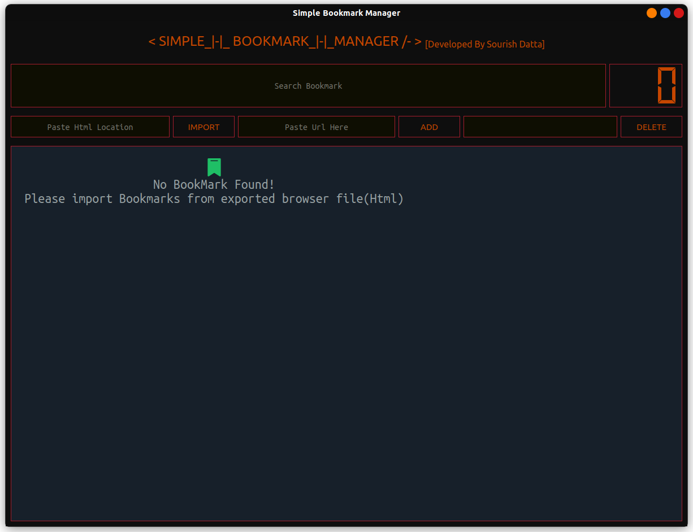
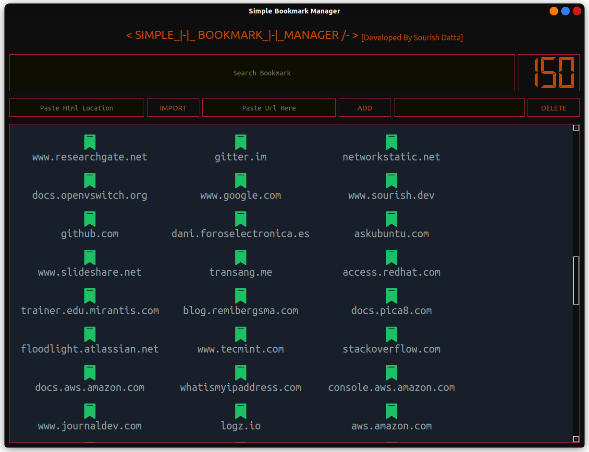

# Simple BookMark Manager

This a very simple bookmark manager developed in pyqt5. This is an offline manager. But for backup purposes I'll recommend you backup the "url_map.json"  file time to time.


## Author

- [@Sourish_Datta](https://www.github.com/xorish)


## Pre-requisite

Install PyQt5 using pip

```bash
pip install PyQt5
```
    
## Deployment

To deploy this project run

```bash
  python3 main.py
```


## Contributing

Pull requests are welcome. For major changes, please open an issue first to discuss what you would like to change.

Please make sure to update tests as appropriate.

## Screenshots





